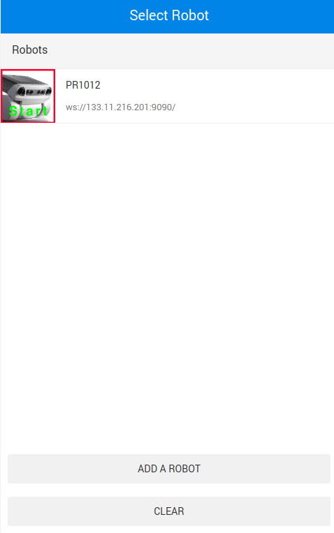
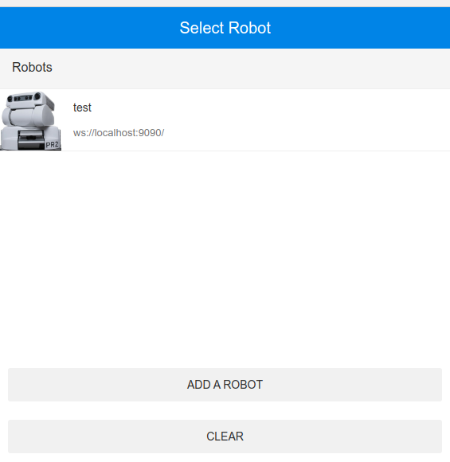
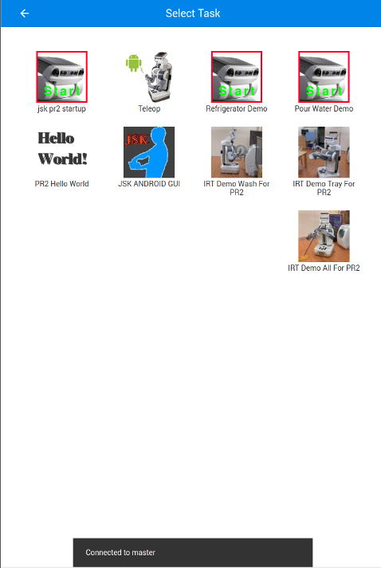

rwt_app_chooser
===============

App chooser client for web browsing device

### Example

1. Launch sample file

    ```bash
    roslaunch rwt_app_chooser sample.launch
    ```

2. You can now access to rwt_app_chooser page from http://localhost:8000/rwt_app_chooser/

   You will see following main page, then add "ADD ROBOT" button.

   

   As for example, you can choose any robot type and name, but you need to set `ws://localhost:9090` for Robot URI

   Then You will choose robot which you just added.

   

   Finally, you can see following task launch page. Clock the 'Hello World' Button.

   


### Usage

1. (On Robot) Launch app manager

    ```bash
    roscore &
    rosparam set robot/type pr2     # aet robot type as rosparam
    rosparam set robot/name pr1012  # set robot name as rosparam
    roslaunch rwt_app_chooser app_manager.launch
    ```
    
    You can use custom installed app list by:
    
    ```bash
    roslaunch rwt_app_chooser app_manager.launch app_list:=/path/to/applist_dir
    ```

2. (On Server) Launch rwt_app_chooser server

    ```bash
    roslaunch rwt_app_chooser rwt_app_chooser.launch
    ```
    
    This can be run on the robot

### Register Your App (Optional)

This section explains how to register your app to app chooser.

#### Prerequisities

- Your desired app name (e.g. `myapp`)
- Your own package (e.g. `mypkg`)
- Your own launch file (e.g. `myapp.launch`)
- Image for icon (e.g. `myapp.png`)

#### Create an App

1. First, locate your package, then create `apps` directory

    ```bash
    roscd mypkg
    mkdir apps && cd apps
    ```

2. Next, create a directory of your desired application and put launch / icon files there.

    ```bash
    mkdir myapp
    cp /path/to/myapp.launch myapp
    cp /path/to/myapp.png myapp
    ```

3. Then define the description of your app

    There are two files that describe your app, `myapp.app` and `myapp.interface`.
    
    `myapp.app` defines information and location to the files for app that are loaded by `app_manager`.
    The content looks like below:

    ```yaml
    display: My Application
    description: This is just my awesome application
    platform: pr2
    launch: mypkg/myapp.launch
    interface: mypkg/myapp.interface
    icon: mypkg/myapp.png
    ```
    
    `myapp.interface` should look like below:
    
    ```yaml
    published_topics:
      /processed/image: sensor_msgs/Image
    subscribed_topics:
      /camera/rgb/image_rect_color: sensor_msgs/Image
    ```

    Congradurations! You just created your own app!
    Now you have four files in the app directory:
    
    ```bash
    $ ls
    myapp.app myapp.interface myapp.launch myapp.png
    ```

4. Register created app to the manager

    To call your app via app chooser, you need to add your app to the list.
    Edit `apps.installed` file in your applist directory and add your app.
    
    ```diff
    apps:
      - app: rwt_app_chooser/hello_world
        display: Hello World
    +  - app: mypkg/myapp
    +    display: My application of mypkg
    ```

Now you should find your app in app chooser. Enjoy!
You can see a sample in [sample/apps](https://github.com/tork-a/visualization_rwt/tree/kinetic-devel/rwt_app_chooser/sample/apps) Directory.

### Author

    Yuki Furuta <furushchev@jsk.imi.i.u-tokyo.ac.jp>
