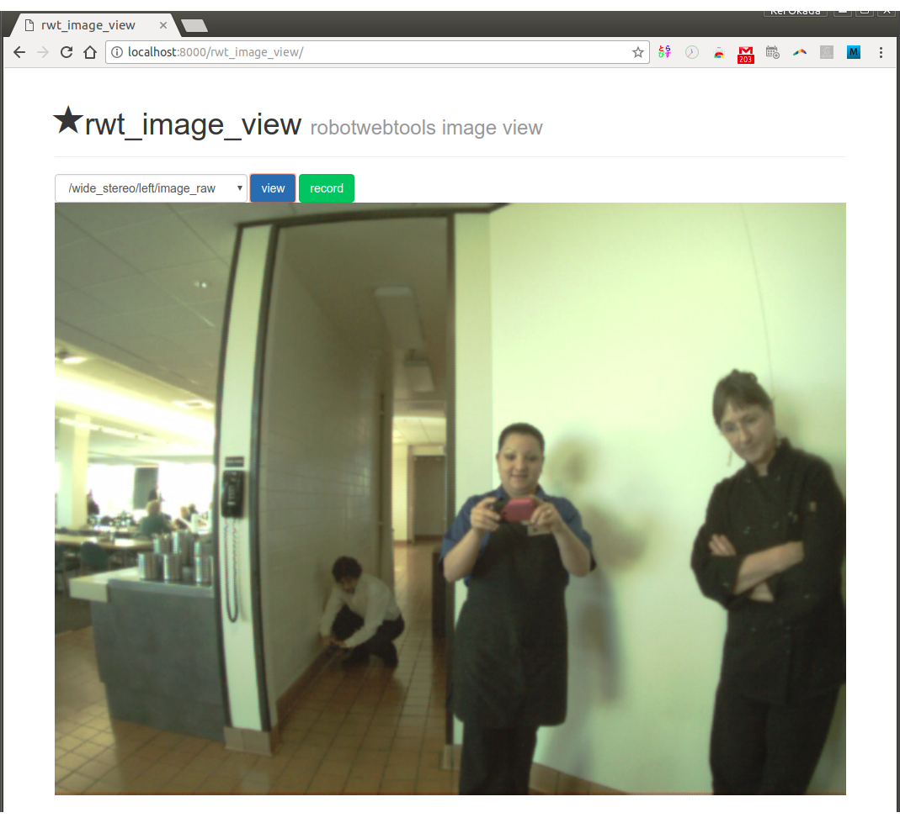

rwt_image_view
==============

Usage
-----
```sh
roslaunch rwt_image_view example.launch # this starts roswww and rosbridge_server and example data publisher
```

and access to http://localhost:8000/rwt_image_view/ using your browser


