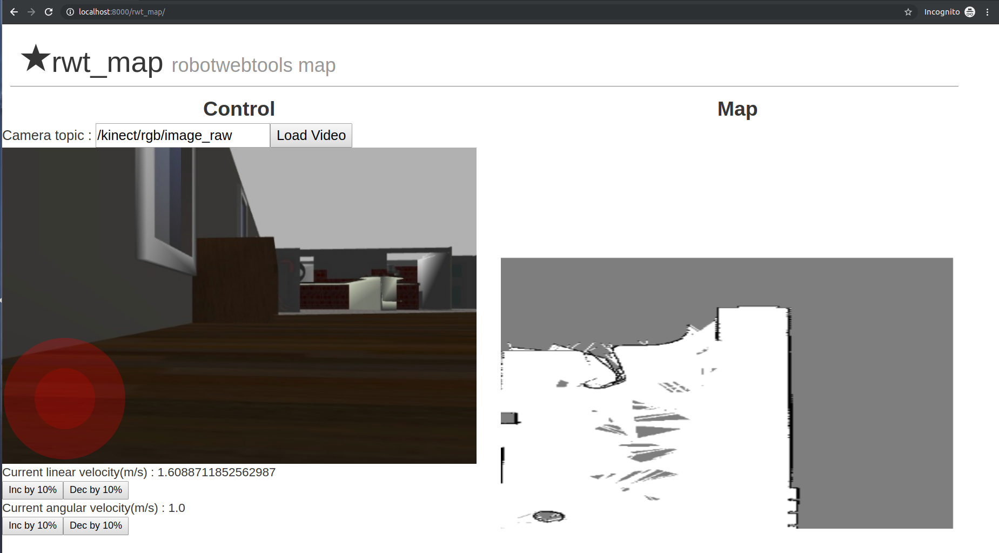

rwt_map
====================

Usage
-----
```
roslaunch rwt_map rwt_map.launch 
```
Launch your gmapping node which provides `/map` topic.

Open your browser, and access to:

`http://<your host name>:8000/rwt_map/`

for example : `http://localhost:8000/rwt_map/`

- Control using Joystick
- Add camera topic
- Press Load video button
- View the map built in real time
- Ctrl + mouse movement = Zoom
- Shift + mouse movement = Pan

To view live location of robot :
```
rosrun robot_pose_publisher robot_pose_publisher
```
- Current position of the robot is shown by Red Arrow 



