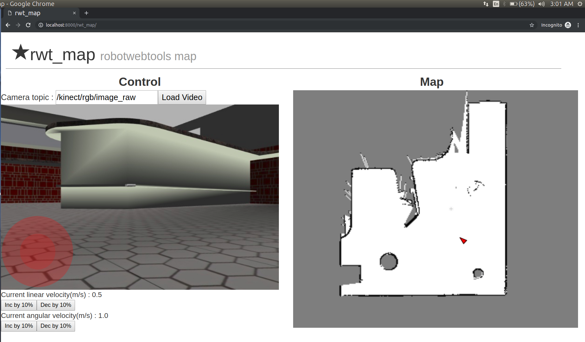

rwt_map
====================

Usage
-----
```
roslaunch rwt_map rwt_map.launch 
```

Open your browser, and access to:

`http://<your host name>:8000/rwt_map/`

for example : `http://localhost:8000/rwt_map/`

- Control using Joystick
- Add camera topic
- Press Load video button



View [demo](https://www.youtube.com/watch?v=oAceJ7BeGoE&t=11s)
