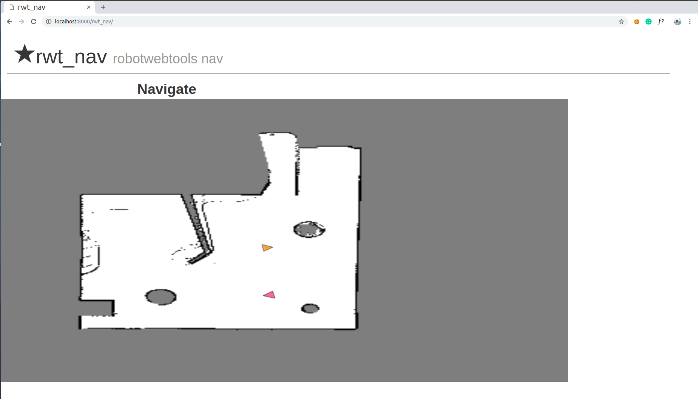

rwt_nav
====================

Usage
-----
```
roslaunch rwt_nav rwt_nav.launch
```

Open your browser, and access to:

`http://<your host name>:8000/rwt_nav/`

for example : `http://localhost:8000/rwt_nav/`

To view live location of robot :
```
rosrun robot_pose_publisher robot_pose_publisher
```
- Current position of the robot is shown by yellow arrow.
- Ctrl + mouse movement = Zoom
- Shift + mouse movement = Pan

Launch the amcl node and move_base node.

Click anywhere on the map to give goal position and direction.

- Goal will be marked with red arrow.


