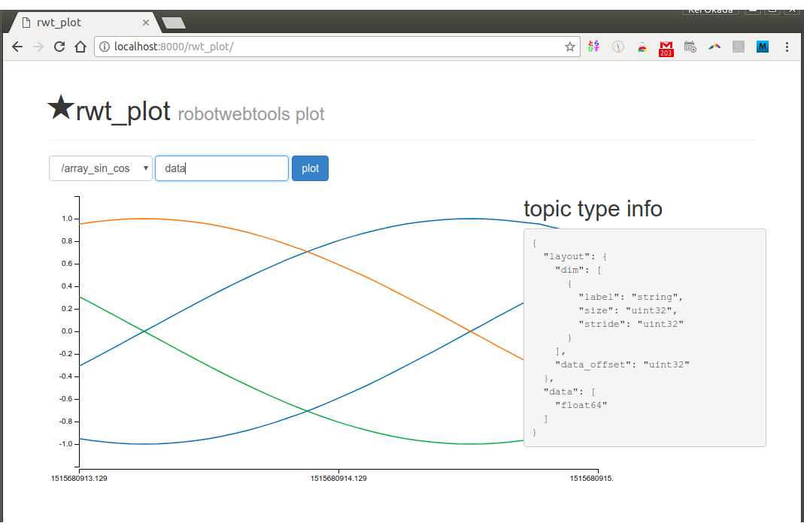

rwt_plot
========

Usage
-----
```sh
roslaunch rwt_plot example.launch # this starts roswww and rosbridge_server and example data publisher
```

and access to http://localhost:8000/rwt_plot/ using your browser



Dependencies
------------
All the dependending projects are included in `rwt_plot` and `rwt_utils_3rdparty`

* [jquery](http://jquery.com) - well-known library
* [lodash](https://github.com/lodash/lodash) - utlity functions
* [d3.js](http://d3js.org/) - graph library
* [bootstrap](http://getbootstrap.com) - css/js library
