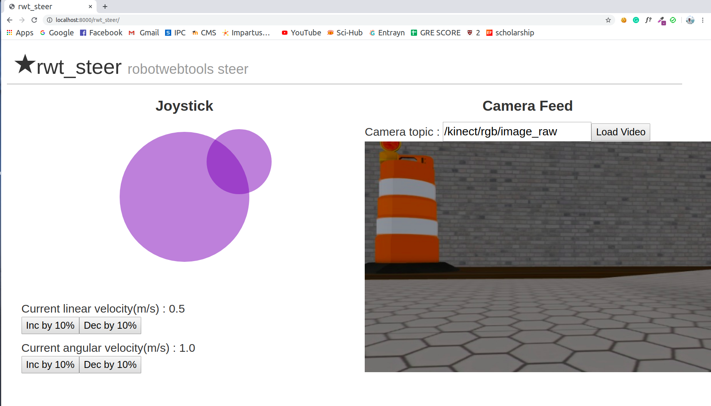

# rwt_steer

## Usage

```bash
roslaunch rwt_steer rwt_steer.launch 
```

Open your browser, and access to `http://<your host name>:8000/rwt_steer/`.

for example : `http://localhost:8000/rwt_steer/`

- Control using Joystick
- Add camera topic
- Press Load video button


